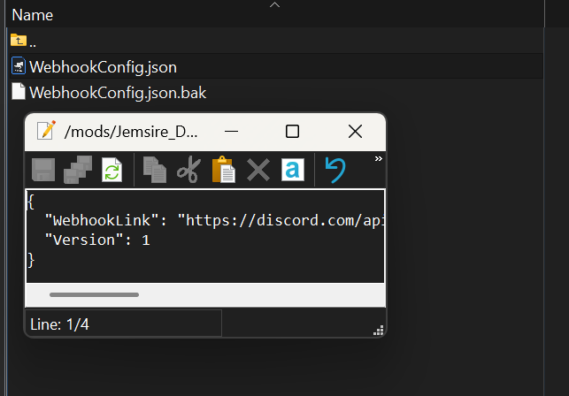
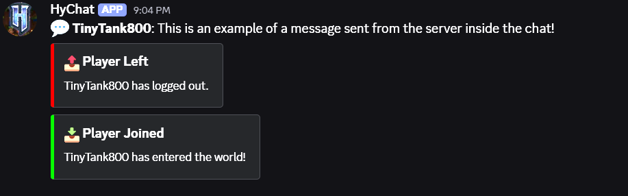

# DiscordWebhook


A Hytale server plugin that links in-game events to a Discord channel using a webhook. This plugin automatically sends player join, leave, deaths, and chat messages to your Discord server.
## Current Features

- **Event Configuration System**: Individual configuration files for each event type
- **Placeholder System**: Dynamic placeholders like `{player}`, `{message}`, `{deathCause}`, etc.
- **Multiple Webhook Channels**: Route different events to different Discord channels
- **Message Customization**: Full control over message format (embeds, plain text, or both)
- **Event Toggling**: Enable or disable individual events
- **Update Check**: Check Github releases for updates and notifies you if there is one
- **Hot Reload**: Reload configuration without restarting the server using `/dw-reload`

## Current Events

- **Player Join Events**: Sends customizable notifications when a player joins the server
- **Player Leave Events**: Sends customizable notifications when a player leaves the server
- **Player Death Events**: Sends customizable notifications when a player dies on the server
- **Player Chat**: Forwards all player chat messages to Discord with full customization

## Installation

1. Download the latest release from the [releases page](https://github.com/jemsire/DiscordWebhook/releases)
2. Place the `DiscordWebhook-x.x.x.jar` file into your Hytale server's `mods` folder
3. Start your server to generate the configuration files
4. Edit the `Jemsire_DiscordWebhook/WebhookConfig.json` file and add your Discord webhook URL(s)
5. (Optional) Customize individual event configs in `Jemsire_DiscordWebhook/events/` folder
6. In-game type `/dw-reload` to hot reload the config to start the plugin

**Note:** Default event configurations are automatically created on first launch. You can customize them or leave them as-is.

## Configuration

After first launch, configuration files will be created in your mods folder. The plugin uses a two-tier configuration system:

1. **WebhookConfig.json**: Main configuration with webhook URLs and channels
2. **events/**: Individual event configuration files

### Getting a Discord Webhook URL

1. Open your Discord server settings
2. Go to **Integrations** → **Webhooks**
3. Click **New Webhook** or select an existing webhook
4. Copy the webhook URL
5. Paste it into your `WebhookConfig.json` file

### Main Configuration File (WebhookConfig.json)

The main configuration file is located at `Jemsire_DiscordWebhook/WebhookConfig.json`:

```json
{
  "WebhookLink": "https://discord.com/api/webhooks/YOUR_WEBHOOK_URL_HERE",
  "Version": 2,
  "UpdateCheck": true,
  "WebhookChannels": {
    "default": "https://discord.com/api/webhooks/YOUR_DEFAULT_WEBHOOK_URL",
    "staff": "https://discord.com/api/webhooks/YOUR_STAFF_WEBHOOK_URL"
  }
}
```

**Configuration Options:**
- `WebhookLink`: Default webhook URL (used as fallback)
- `Version`: Configuration version (currently 2)
- `UpdateCheck`: Enable/disable automatic update checking
- `WebhookChannels`: Map of channel names to webhook URLs (e.g., "default", "staff", "admin")

### Event Configuration Files

Each event has its own configuration file in `Jemsire_DiscordWebhook/events/`. Default configs are automatically created on first launch:

- `PlayerChat.json` - Player chat messages
- `PlayerReady.json` - Player join events
- `PlayerDisconnect.json` - Player leave events
- `PlayerDeath.json` - Player death events

#### Event Configuration Structure

```json
{
  "Enabled": true,
  "WebhookChannel": "default",
  "MessageJson": "{\"content\": \"💬 **{player}**: {message}\"}"
}
```

**Configuration Options:**
- `Enabled`: Enable or disable this event (true/false)
- `WebhookChannel`: Which webhook channel to use (must match a key in `WebhookChannels` from main config)
- `MessageJson`: Raw Discord webhook JSON with placeholders (see below)

#### Message Format Examples

**Plain Text Message:**
```json
{
  "Enabled": true,
  "WebhookChannel": "default",
  "MessageJson": "{\"content\": \"💬 **{player}**: {message}\"}"
}
```

**Embed Message:**
```json
{
  "Enabled": true,
  "WebhookChannel": "default",
  "MessageJson": "{\"embeds\": [{\"title\": \"📥 Player Joined\", \"description\": \"{player} has entered the world!\", \"color\": 65280}]}"
}
```

**Combined (Text + Embed):**
```json
{
  "Enabled": true,
  "WebhookChannel": "default",
  "MessageJson": "{\"content\": \"New player!\", \"embeds\": [{\"title\": \"Player Joined\", \"description\": \"{player} joined the server\", \"color\": 65280}]}"
}
```

#### Available Placeholders

Placeholders are replaced at runtime with actual values. Use `{placeholderName}` in your JSON strings.

- `{player}` - Player's username
- `{playerUsername}` - Player's username (alias)
- `{message}` - Chat message content
- `{content}` - Chat message content (alias)
- `{playerUuid}` - Player's UUID (if available)
- `{deathCause}` - Formatted death message
- `{deathMessage}` - Formatted death message (alias)
- `{deathMessageRaw}` - Raw death message (if available)

**Note:** Some Placeholders wont work in some events. Placeholders are automatically escaped for JSON, so special characters won't break your webhook payload.

## Screenshots

### Main Configuration File


### Event Configuration Files


### Discord Messages


## Commands

- `/dw-reload` - Reloads the plugin configuration without restarting the server
  - **Permission**: `discordwebhook.reload`
  - **Usage**: Only reloads if the configuration has changed

## How It Works

### Architecture

The plugin follows a modular architecture:

- **Main Plugin Class** (`DiscordWebhook.java`): Handles plugin initialization, event registration, configuration management, and thread pool for async operations
- **Event Handlers**: Listen for Hytale server events and collect placeholder data
- **Event Configuration System** (`EventConfigManager.java`): Manages individual event configs with enable/disable, webhook channels, and custom messages
- **Placeholder Replacer** (`PlaceholderReplacer.java`): Replaces placeholders in JSON templates with actual values
- **Webhook Sender** (`DiscordWebhookSender.java`): Handles asynchronous HTTP requests to Discord's webhook API via thread pool
- **Configuration System**: Manages webhook URL storage, channels, and reloading

### Event Flow

1. **Event Occurs**: A Hytale server event is triggered (e.g., player joins, chats, dies)
2. **Event Handler**: The corresponding event handler collects relevant data (player name, message, etc.)
3. **Placeholder Map**: Event data is converted into a placeholder map (e.g., `{"player": "Steve", "message": "Hello!"}`)
4. **Config Lookup**: The system looks up the event's configuration file (e.g., `PlayerChat.json`)
5. **Placeholder Replacement**: Placeholders in the `MessageJson` are replaced with actual values
6. **Webhook Channel Resolution**: The configured webhook channel is resolved to a webhook URL
7. **Async Send**: The final JSON is sent to Discord asynchronously via a background thread (non-blocking)

### Event Handlers

1. **Player Join** (`OnPlayerReadyEvent.java`):
   - Listens for `PlayerReadyEvent`
   - Provides placeholders: `{player}`, `{playerDisplayName}`, `{playerUsername}`, `{playerUuid}`

2. **Player Leave** (`OnPlayerDisconnectEvent.java`):
   - Listens for `PlayerDisconnectEvent`
   - Provides placeholders: `{player}`, `{playerUsername}`, `{playerUuid}`

3. **Player Death** (`OnPlayerDeathEvent.java`):
   - Listens for `DeathSystems.OnDeathSystem` events
   - Provides placeholders: `{player}`, `{playerDisplayName}`, `{playerUsername}`, `{playerUuid}`, `{deathCause}`, `{deathMessage}`, `{deathMessageRaw}`

4. **Player Chat** (`OnPlayerChatEvent.java`):
   - Listens for `PlayerChatEvent`
   - Provides placeholders: `{player}`, `{playerUsername}`, `{message}`, `{content}`, `{playerUuid}`

### Message Formatting

- **Customizable Format**: Each event can use plain text, embeds, or both
- **Placeholder System**: Dynamic values are injected at runtime
- **JSON Escaping**: All placeholder values are properly escaped to prevent JSON injection
- **Multiple Channels**: Different events can route to different Discord channels via webhook channels

## Building from Source

### Prerequisites

- Java Development Kit (JDK) 25 or higher
- Gradle 8.0 or higher

### Build Steps

1. Clone the repository:
   ```bash
   git clone https://github.com/jemsire/DiscordWebhook.git
   cd DiscordWebhook
   ```

2. Ensure `HytaleServer.jar` is in the `libs/` directory

3. Build the project:
   ```bash
   ./gradlew build
   ```

4. The compiled JAR will be in `build/libs/DiscordWebhook-x.x.x.jar`

## Project Structure

```
DiscordWebhook/
├── src/main/java/com/jemsire/
│   ├── commands/
│   │   └── ReloadCommand.java           # Command handler for /dw-reload
│   ├── config/
│   │   ├── WebhookConfig.java           # Main configuration data class
│   │   ├── EventConfig.java             # Individual event configuration data class
│   │   └── EventConfigManager.java      # Manager for event configs (loading, saving, caching)
│   ├── events/
│   │   ├── OnPlayerChatEvent.java       # Handles player chat messages
│   │   ├── OnPlayerDisconnectEvent.java # Handles player disconnections
│   │   ├── OnPlayerDeathEvent.java      # Handles player deaths
│   │   └── OnPlayerReadyEvent.java      # Handles player joins
│   ├── plugin/
│   │   └── DiscordWebhook.java          # Main plugin class
│   └── utils/
│       ├── DiscordWebhookSender.java     # Webhook HTTP client
│       ├── PlaceholderReplacer.java     # Placeholder replacement utility
│       ├── UpdateChecker.java           # Checks for updates
│       └── Logger.java                  # Logging utility
├── src/main/resources/
│   └── manifest.json                    # Plugin metadata
├── build.gradle.kts                     # Gradle build configuration
└── settings.gradle.kts                  # Gradle project settings
```

## Technical Details

### Dependencies

- **HytaleServer.jar**: Provided at compile time, required at runtime
- **Java Standard Library**: Uses `java.net` for HTTP connections and `javax.net.ssl` for HTTPS

### Security

- Webhook URLs are stored in configuration files (not in code)
- JSON content is properly escaped to prevent injection attacks
- Permission-based command access (`discordwebhook.reload`)

### Performance

- **Asynchronous Webhook Sending**: All webhook operations run in background threads to prevent blocking the game server
- **Thread Pool**: Uses a fixed thread pool (2 threads) for concurrent webhook operations
- **Non-Blocking**: Network requests never block the main game thread, ensuring smooth gameplay
- **Update Checking**: Update checks run asynchronously during startup to avoid delays

### Error Handling

- Validates webhook URL is set before sending messages
- Logs errors to server console if webhook requests fail
- Gracefully handles network errors without crashing the server
- 5-second timeout on all HTTP connections to prevent hanging

## Troubleshooting

### Messages Not Appearing in Discord

1. **Check Webhook URLs**: Ensure webhook URLs in `WebhookConfig.json` and event configs are correct
2. **Verify Webhook Status**: Check if the webhooks are still active in Discord
3. **Check Event Enabled Status**: Verify that `"Enabled": true` in the event's JSON file
4. **Check Webhook Channel**: Ensure the `WebhookChannel` in event config matches a channel in `WebhookChannels`
5. **Check Server Logs**: Look for error messages in the server console
6. **Reload Config**: Use `/dw-reload` after updating the configuration
7. **Validate JSON**: Ensure your `MessageJson` is valid JSON (use a JSON validator)

### Permission Errors

- Ensure you have the `discordwebhook.reload` permission to use the reload command
- Check your server's permission system configuration

### Placeholders Not Replacing

- Check that placeholder names match exactly (case-sensitive)
- Ensure placeholders use the format `{placeholderName}` (with curly braces)
- Verify that the event handler provides the placeholder you're trying to use
- Check server logs for warnings about missing placeholders

### Event Not Triggering

- Verify the event config file exists in `Jemsire_DiscordWebhook/events/`
- Check that `"Enabled": true` in the event config
- Ensure the `MessageJson` field is not empty
- Check server logs for event-related errors

## Contributing

Contributions are welcome! Please feel free to submit a Pull Request.

## License

This project is licensed under the MIT License - see the LICENSE file for details.

## Author

**TinyTank800**

- Website: [https://jemsire.com/DiscordWebhook](https://jemsire.com/DiscordWebhook)

## Support

For issues, feature requests, or questions, please open an [Issue](https://github.com/jemsire/discordwebhook/issues).
